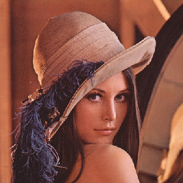
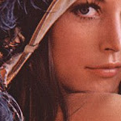
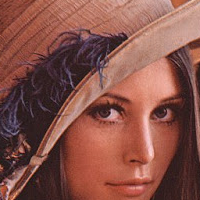
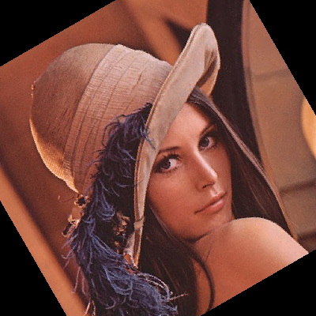
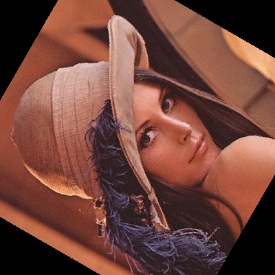
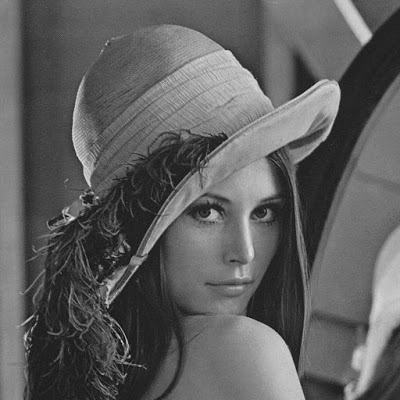
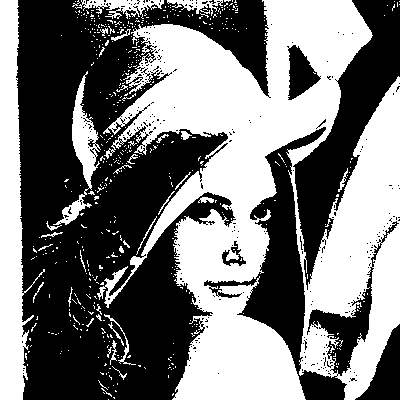

## Some basics on images we see everyday

Ever wondered how the images you take everyday with your phones / cameras get stored? How image viewers read images and show them to you? How all the image editing applications can resize, rotate, apply filters etc. on an image?

Sometimes, it seems like magic. Simply because common folk don't know how things get done in the hindsight. So lets explore some of those magic tricks.

## What we're going to do?

The first job is to read images and store them in memory for manipulation. Then let's see what magic tricks we can pull on them!

## What we need

You'll need to install the following modules.

- numpy
- pillow

How?

```bash
pip install numpy pillow
```

You're good to go!

## First thing first, import the modules


```python
import PIL
import numpy as np
```

## Before diving in, what's an image actually?

- 1024 X 768
- 640 x 480
- 4096 X 2160
- 1920 X 1080
- 5120 X 2880
- 8K

What do these numbers mean? Well go to properties of an image stored on your computer. Look at the resolution of that image and try to find the resemblance. No shit sherlock, these look like image resolutions.

Also if you look closely these can also be regarded as 2D grids of height X width dimension. 

### So images are ..............
Yes, images you see and take with your camera are actually 2D grids and the resolution just states the dimension. But hold on for a sec! Computer doesn't understand what a grid is. It only understands numbers.... oh wait!

### Matrices anybody?
An image is actually stored as a 2D matrix in a computer storage / memory (both are different, mind you!). So an image of resolution 4 X 4 would look like this as a matrix: 


Now fine we get it images are all glorious 2D matrices, but what do the elements contain? 

### Pixels...................a whole lotta pixels
A pixel is the unit element of an image. A pretty text bookish definition. Let's clear it up. 

Each element of the 2D matrix from an image is a pixel. A pixel contains a fixed value that represents the **color value of that cell in the 2D image grid.**

### Color value, which means ......
Which means if you change the pixel values, the color of the image would change as well. That's how you get those wonderful instagram filters.

### Read from image?

All right let's get on with it. Let's get an image first. We'll use this image for now. If you go into advance studies in Digital Image Processing, you'll see how significant this image was in the history of image processing. I'll just leave the history for you to explore.


### Let's get some code


```python
image_path = "lena.jpg" # path for our image

# let's add a function for reading image so we can use it later
def read_image(path):
    try:
        image = PIL.Image.open(path)
        return image
    except Exception as e:
        print(e)
```


```python
image = read_image(image_path)
image
```


Whoah! That was quick. Let's check around a bit with the image we got from the function.


```python
print(type(image))
```

```bash
<class 'PIL.JpegImagePlugin.JpegImageFile'>
```


### Enter `numpy` : converting image to array

So far we've been using the PIL objects. Let's get our hands dirty and read raw pixel values


```python
img_array = np.array(image)
img_array
```

```bash
    array([[[194, 108,  73],
            [198, 112,  77],
            [193, 109,  73],
            ...,
            [150,  82,  61],
            [143,  79,  54],
            [141,  81,  55]],

           [[196, 110,  75],
            [198, 114,  78],
            [194, 110,  74],
            ...,
            [150,  79,  57],
            [145,  79,  55],
            [147,  85,  60]],

           [[197, 113,  77],
            [199, 115,  79],
            [196, 112,  76],
            ...,
            [153,  81,  59],
            [146,  80,  56],
            [147,  83,  58]],

           ...,
           [[161,  86,  57],
            [169,  94,  65],
            [178, 101,  71],
            ...,
            [ 69,  39,  37],
            [ 70,  40,  38],
            [ 71,  41,  39]],

           [[164,  89,  60],
            [168,  93,  64],
            [174,  97,  67],
            ...,
            [ 69,  39,  39],
            [ 70,  40,  38],
            [ 72,  41,  39]],

           [[159,  84,  55],
            [166,  91,  62],
            [175,  98,  68],
            ...,
            [ 69,  39,  39],
            [ 71,  41,  39],
            [ 72,  41,  39]]], dtype=uint8)

```


So Pillow has stored the image in our computers RAM as a PIL object. And the rest of the output should be obvious to you. It's a jpeg image after all. And using `numpy` we can convert it to an array and confirm that the image is a 2D grid. Nice!

So now that we have read the image, what else can we do? Well let's start with the most obvious. Resizing.

### Resizing image

Let's resize the image. But hold on, resize to what? I mean we need a dimension to get started with first. So if we write a function, we need to pass the `height` and the `width` of the new size as params. Okay let's do it. 

But how do we resize? Well, PIL.Image has a resize function for you to use. It takes a tuple as agrument. The tuple should be of the format (height, width) of the new size. Let's resize this image. But first, let's check the resolution of the current image.


```python
def get_image_res(image):
    return image.size

print(get_image_res(image))
```

    (400, 400)


So, we have a 400 X 400 image. Let's get onto resizing then.


```python
def resize_image(image, height, width):
    resized_image = image.resize((height, width))
    return resized_image
```

Let's resize the image into 300 X 300


```python
resize_image = resize_image(image, 300, 300)
resize_image
```





Let's check the size of the resized image.


```python
print(get_image_res(resize_image))
```

    (300, 300)


Voila! We resized the image! Next up : Cropping.

### Cropping image

### Cropping basics

Cropping an image basically means that you select a certain rectangular area from an image and disregard the rest. Leaving only the rectangular area or cropped area behind.

PIL.Image has a crop function to assist us in here. Again we have to supply a tuple with the coordinates of the recatngular area.


```python
def crop(image, left, top, right, bottom):
    cropped = image.crop((left, top, right, bottom))
    return cropped
```

Let's do an arbitrary crop of the original image (not the resized one, leave it be there)


```python
cropped = crop(image, 100, 200, 250, 350)
cropped
```





### Center Crop

Now let's make it interesting, what if we want to crop only the center of an image? Let's aboard the math train. An image is a 2D matrix, however its dimension also makes it a rectangle. Since we know the dimensions, to get to the center we just need to know the center of the rectangle.


```python
def center_image(image):
    width, height = image.size
    left = width / 4
    top = height / 4
    right = 3 * width / 4
    bottom = 3 * height / 4
    
    return ((left, top, right, bottom))
```


```python
center = center_image(image)
center
```

```bash
(100.0, 100.0, 300.0, 300.0)
```


Now that we have the center, let's do a center crop.


```python
left, top, right, bottom = center # unpack the tuple
center_cropped = crop(image, left, top, right, bottom)
center_cropped
```





### Rotating image

Well images can rotated at a certain angle from their base as well. It's actually like this.

Example 1                                    |  Example 2
:-------------------------------------------:|:-------------------------------------------:
    |   


We will be using the rotate function from PIL.Image to rotate the image. 


```python
def rotate_image(image, angle):
    return image.rotate(angle)
```


```python
rotated_by_30 = rotate_image(image, 30)
rotated_by_30
```





```python
rotated_by_60 = rotate_image(image, 60)
rotated_by_60
```





And you can just keep it rotating! Just pass in the angle.

### Enough cropping resizing. Let's change the colors.

Okay let's get onto real image manipulation. Popular image editors allow you to run an image to black and white, grayscale etc. We'll explore two of those here. Grayscale and pure B&W.

### Let's turns things grayscale!

Here however we need to go for another math ride. Because understanding the concepts will come in handy later on.

### Difference between color and grayscale images

Remember when I said an image is a 2D grid? Well for color images, that's a bit different. For a color image, it's actually 3 layers of 2D grids stacked on one another. These layers are called color channels. Which means, each pixel has 3 values from 3 channels. That's how color images get their color. The following image will give you some idea.


Then how does grayscale differ? Well a grayscale image has only 1 color layer. So, it's a single 2D grid.

But there's more! We haven't talked about image depth yet!

### Image depth

16 bit image, 32 bit image, have you ever wondered why they call it so? Well these bits actually mean the range of colors the pixels can have. It's called color depth. The bigger the color depth the more life like color the images will show. However at a cost. Higher color depth means the images will store more information and will take more memory. But memory is cheap these days. Even mobile phones are getting over 100GB of storage.

### Further reading material on this

I wrote this post long ago in my blog. I used OpenCV back then. OpenCV is kinda hard to use for learning. Don't worry about the code. Just get the concepts.

- [ওপেনসিভি + পাইথনে ইমেজ প্রসেসিং # ৫ – বহুরূপী ইমেজ – ১](https://rockash93.wordpress.com/2017/04/11/ওপেনসিভি-পাইথনে-ইমেজ-প্র-5/)
- [ওপেনসিভি + পাইথনে ইমেজ প্রসেসিং # ৩ – ইমেজ কি জিনিস?](https://rockash93.wordpress.com/2017/04/11/ওপেনসিভি-পাইথনে-ইমেজ-প্র-3/)


Enough chatter, let's convert that image to grayscale.


```python
print(img_array.shape)
```

```bash
(400, 400, 3)
```


Now look carefully, 400, 400 is the image resolution. But what is that 3? Since it's a color image, we've that additional dimension added in. 

So, to turn things grayscale we need to make that 3 -> 1. We can just directly manipulate the numpy array and apply some sophisticated algorithm like [Otsu's method](https://en.wikipedia.org/wiki/Otsu%27s_method).

But nope, let's keep it simple. We'll use Pillow only. It's easier.


```python
def convert_to_grayscale(image):
    grayscale = image.convert("L") # just one line, done
    return grayscale
```


```python
grayscale = convert_to_grayscale(image)
grayscale
```





### Moment of truth! Let's confirm the channels!

```python
gray_arr = np.array(grayscale)

print(gray_arr.shape)
```
```bash
(400, 400)
```


We did it! xD Now let's convert to black and white. Or in technical terms, binary image.

### So what's a binary image

In simplest of terms, the pixels in a binary image can only have two colors, either white (which has a value of 255) or black (which is 0). Now why 255 and 0? Remember color depth? B&W images are 8 bit, meaning pixels can have value only in the range 0~255 ( which is 0 ~ 2^8 - 1 )

**Example of a binary image**


### Converting to binary

So how do we approach this problem? Well it's kinda simple. You make the image(converted to grayscale beforehand) an array, and then go through each pixel and apply a boolean operation. For this you need a threshold value. That value can be anything.  We'll apply 100 here. But to get the best results you can apply Otsus method yourself.


Let's do it then!


```python
def get_binary_image(image, threshold):
    grayscale = convert_to_grayscale(image)
    arr = np.array(grayscale)
    
    for i in range(0, len(arr)):
        for j in range(0, len(arr[i])):
            if arr[i][j] >= threshold:
                arr[i][j] = 255
            else:
                arr[i][j] = 0
                
    return PIL.Image.fromarray(arr)
```


```python
bin_image = get_binary_image(image, 100)
bin_image
```





## Done!

So there we have it! We read an image, converted it to an array, then manipulated some pixel values to convert it to binary image, we also converted to grayscale. There are a lot more we can do here. I'll leave that for you to explore.

## If you're interested in Digital Image processing

If you're interested to go in depths of digital image processing, you can explore these:

- [Digital Image Processing by R.C.Gonzalez](https://amzn.to/2Kuhws8)
- [Coursera: Image and Video Processing: From Mars to Hollywood with a Stop at the Hospital by Duke University](https://www.coursera.org/learn/image-processing)
- [Fundamentals of Digital Image and Video Processing by Northwestern University](https://www.coursera.org/learn/digital)
- [PIL Documentation](https://pillow.readthedocs.io/en/5.1.x/index.html)
- [Scikit-Image Examples](http://scikit-image.org/docs/stable/auto_examples/index.html)
